# OpenAPI CLI TUI Architecture

## Overview

This is a **single-program Bubble Tea TUI** that implements a professional OpenAPI testing tool with screen-based navigation. The architecture follows the **Model-View-Update (MVU)** pattern with embedded sub-models for feature isolation.

## Core Components

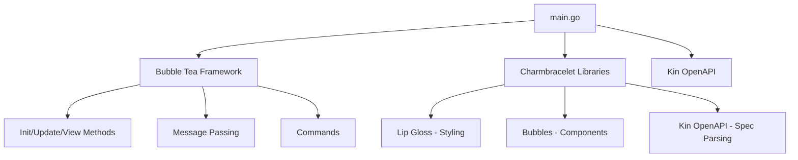

## User Flow Diagrams

### Main Navigation Flow

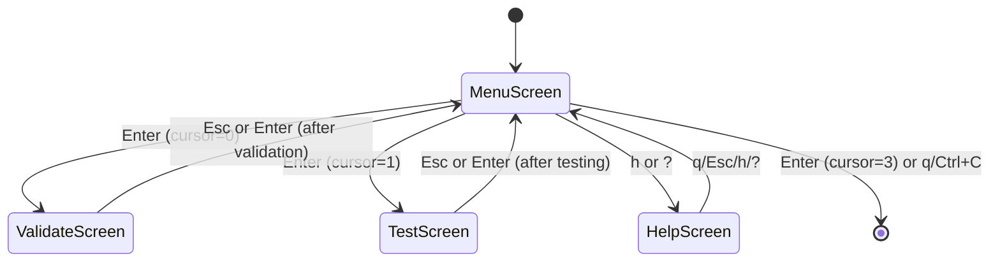

### Validation Screen Flow

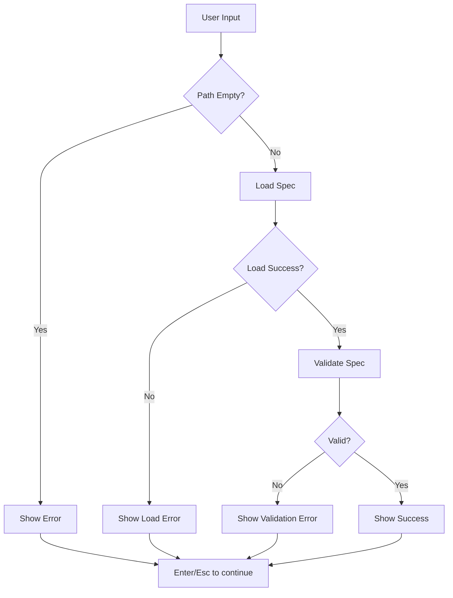

### Testing Screen Flow

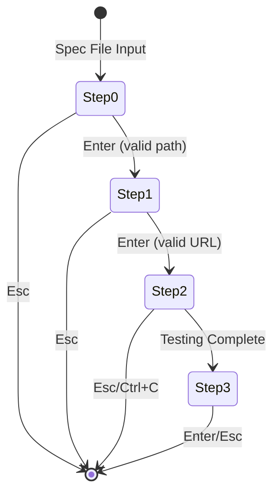

### Message Flow Architecture

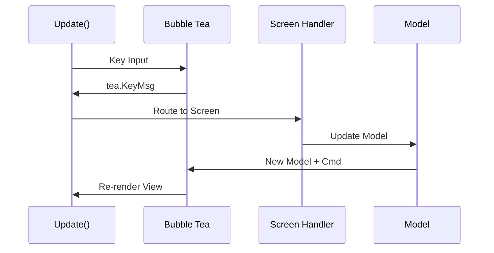

## Screen State Management

The application uses a **finite state machine** with four screens:

```go
type screen int
const (
    menuScreen screen = iota // Main menu with navigation options
    helpScreen               // Help/documentation screen
    validateScreen           // OpenAPI spec validation screen
    testScreen               // API endpoint testing screen
)
```

### Screen Transitions

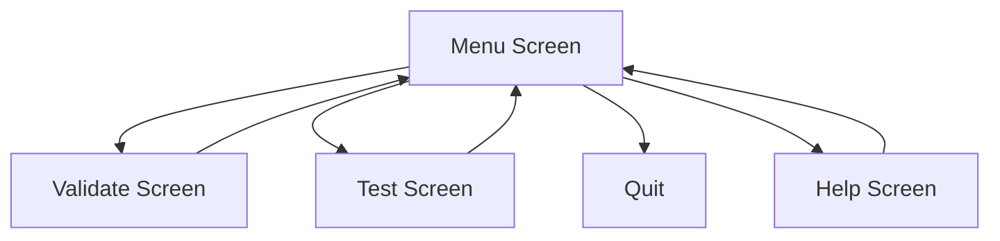

## Embedded Model Architecture

The main model embeds specialized sub-models for each feature:

```go
type model struct {
    screen         screen
    cursor         int
    width, height  int
    validateModel  validateModel  // Embedded validation state
    testModel      testModel       // Embedded testing state
}
```

### Sub-Model Responsibilities

**validateModel:**
- Text input for spec file path
- Validation result/error state
- Completion flag

**testModel:**
- Multi-step workflow state (0-3)
- Spec file input
- Base URL input
- Spinner for progress
- Results table
- Testing flag

## Async Operations with Commands

The testing workflow uses Bubble Tea commands for non-blocking operations:

```go
func runTestCmd(specPath, baseURL string) tea.Cmd {
    return func() tea.Msg {
        results, err := runTests(specPath, baseURL)
        return testResultMsg{results: results, err: err}
    }
}
```

### Command Flow

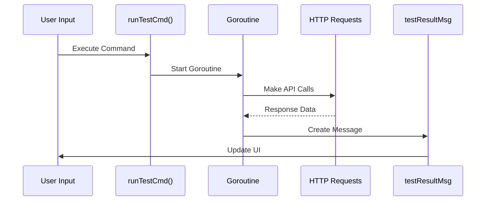

## Dynamic Responsive Layout

The application adapts to terminal size changes:

```go
case tea.WindowSizeMsg:
    m.width = msg.Width
    m.height = msg.Height
    return m, nil
```

All screens use `lipgloss.Place()` for centering:

```go
return lipgloss.Place(
    m.width, m.height,
    lipgloss.Center, lipgloss.Center,
    borderedContent,
    lipgloss.WithWhitespaceChars(" "),
    lipgloss.WithWhitespaceForeground(lipgloss.Color("#333")),
)
```

## Business Logic Layer

### Validation Logic

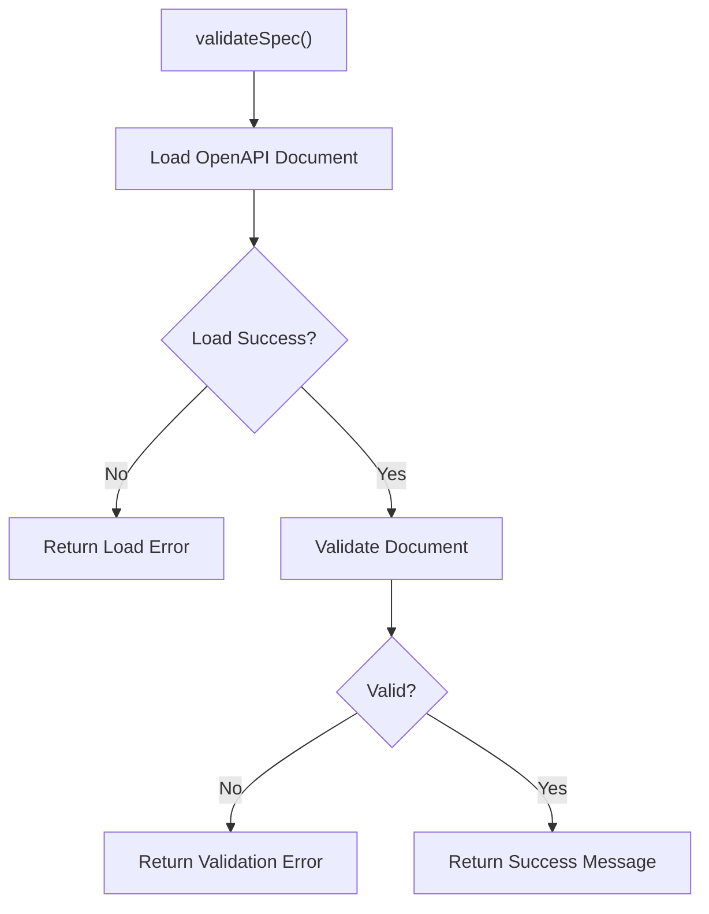

### Testing Logic

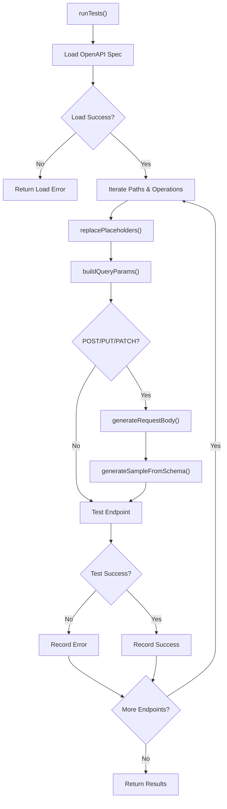

## Request Body Generation

The application intelligently generates request bodies for POST/PUT/PATCH operations:

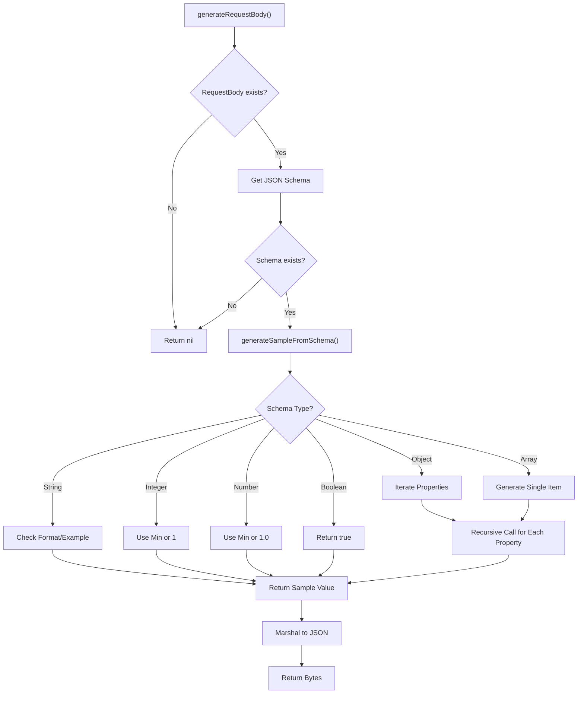

### Schema Type Handling

The request body generator supports:

- **Primitives**: string, integer, number, boolean
- **Complex Types**: object (nested), array
- **String Formats**: email, uri/url, date, date-time
- **Schema Features**: example, default, enum, min/max
- **Nested Structures**: Recursive generation for deep schemas

## Query Parameter Handling

Query parameters are automatically extracted from the OpenAPI spec and appended to URLs:

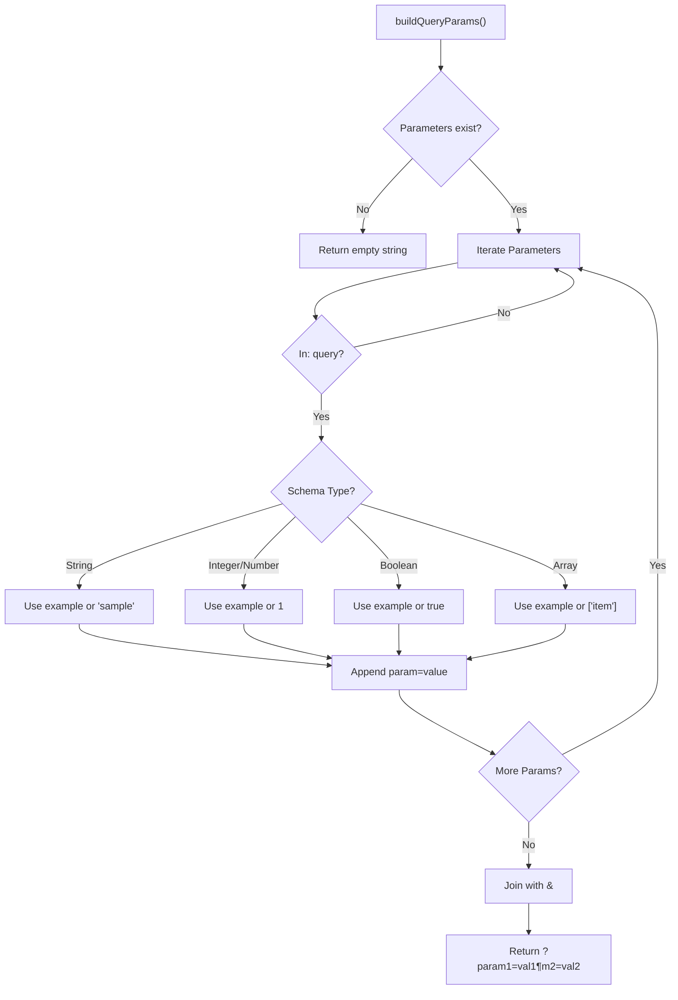

## Path Parameter Handling

Path parameters (e.g., `/users/{id}`) are automatically replaced with sample values:

```go
// replacePlaceholders() uses regex to replace {param} with "1"
"/users/{id}" → "/users/1"
"/users/{userId}/posts/{postId}" → "/users/1/posts/1"
```

## Styling System

The application uses a consistent color scheme:

- **Primary**: `#4ECDC4` (Teal) - Success, borders, cells
- **Secondary**: `#7D56F4` (Purple) - Headers, titles
- **Accent**: `#FF6B6B` (Red) - Errors, selected items
- **Background**: `#FAFAFA` (Light Gray) - Headers
- **Text**: `#888` (Gray) - Instructions, status

## Error Handling

Comprehensive error handling at all levels:

- **Input Validation**: Empty fields, invalid paths
- **File Operations**: Spec loading failures
- **Network Requests**: Connection timeouts, invalid responses
- **Spec Validation**: OpenAPI compliance issues
- **UI State**: Graceful fallbacks for edge cases

## Key Design Decisions

1. **Single Program Architecture**: Eliminates terminal window breaking by keeping everything in one Bubble Tea program
2. **Screen State Management**: Clean separation of concerns with dedicated handlers per screen
3. **Embedded Models**: Feature isolation while maintaining shared state
4. **Async Commands**: Non-blocking operations for smooth UX during testing
5. **Responsive Design**: Adapts to any terminal size with dynamic centering
6. **Professional Styling**: Consistent color scheme and modern UI elements
7. **Intelligent Request Generation**: Automatic body and parameter generation from OpenAPI schemas
8. **HTTP Timeout Protection**: 10-second timeout prevents hanging on unresponsive endpoints
9. **Comprehensive Test Coverage**: 30.3% coverage with table-driven tests and edge cases

## Component Architecture

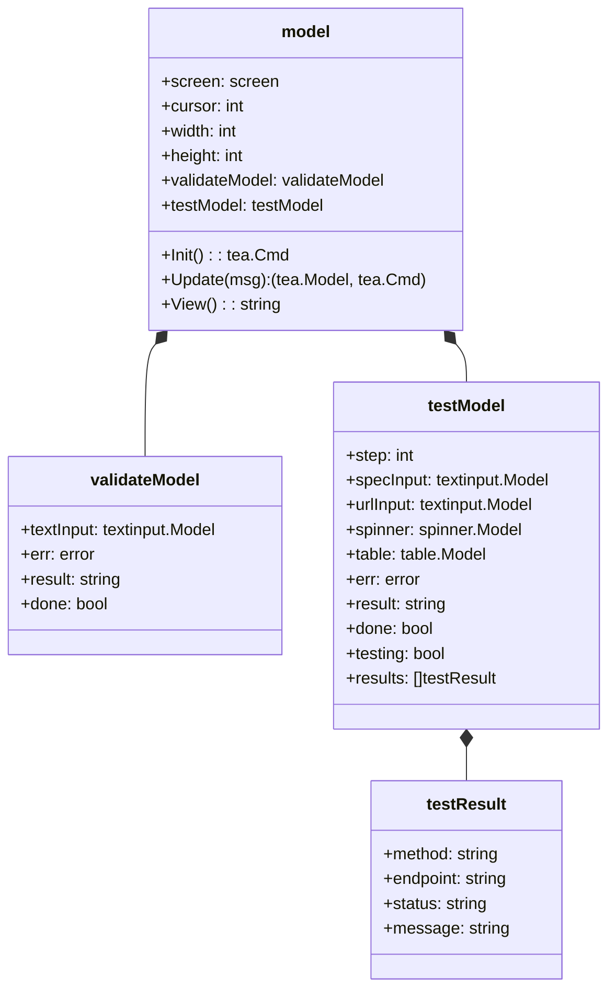

## Testing Functions

Key business logic functions with test coverage:

### Core Testing Functions
- `runTests(specPath, baseURL)` - Main testing orchestrator
- `testEndpoint(method, url, body)` - HTTP client with 10s timeout
- `replacePlaceholders(path)` - Replace `{id}` with `"1"` using regex
- `buildQueryParams(operation)` - Generate query strings from spec
- `generateRequestBody(operation)` - Create JSON from schema
- `generateSampleFromSchema(schema)` - Recursive schema-to-sample converter

### Validation Functions
- `validateSpec(specPath)` - OpenAPI spec validation

### Test Coverage
- **Current Coverage**: 30.3% of statements
- **Test Files**: 9 test functions, 50+ test cases
- **Test Types**: Unit tests, integration tests, table-driven tests
- **Edge Cases**: Nil handling, invalid inputs, nested structures

## Recent Enhancements

### Phase 1 Implementation (Completed)

1. **Unit Tests (#1)** ✅
   - Created comprehensive test suite
   - Table-driven tests for all core functions
   - Coverage baseline: 21.9% → 30.3%

2. **Request Body Generation (#2)** ✅
   - Intelligent JSON generation from OpenAPI schemas
   - Support for nested objects, arrays, primitives
   - Format-aware generation (email, date, uri)
   - Example and default value usage
   - 14 test cases covering all schema types

3. **Query Parameter Handling (#4)** ✅
   - Automatic extraction from operation specs
   - Type-aware sample value generation
   - Proper URL encoding with `?` and `&`
   - Integration with testing pipeline

### Pending Features

- **Response Schema Validation (#3)** - Compare responses against spec schemas
- **Authentication Support (#5)** - Bearer tokens, API keys, Basic auth
- **15 Additional Features** - See project roadmap for Phase 2-4

This architecture provides a robust, maintainable, and user-friendly TUI for OpenAPI testing. The recent enhancements enable realistic API testing with automatically generated request bodies, query parameters, and path parameter substitution. Future phases will add response validation, authentication, error reporting improvements, and advanced features like custom request editing and spec diffing.
